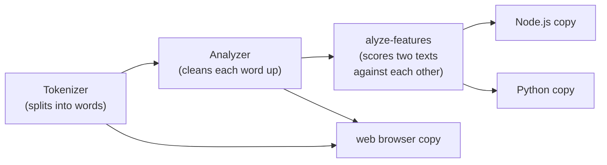

# Overview

The home page and navigation hub for this codebase's wiki.

## Start here: a worked example

Say you type `Running fast!` into a search box. Here is exactly what this code does to that text, one step at a time. Nothing below this needs any background, just read it top to bottom.

1. **Split it into words.** `Running`, `fast`, `!`. (Punctuation gets split off too, on its own.)
2. **Throw away anything that isn't a real word.** `!` is gone. Only `Running` and `fast` are left.
3. **Clean up each word that's left, one small change at a time:**
   - Is it too long? If so, cut it. (Neither word here is.)
   - Make it lowercase: `Running` becomes `running`.
   - Is it a filler word like "the" or "and"? If so, drop it. (Neither word here is.)
   - Shrink it to its root form: `running` becomes `run`.
   - Replace any accented letters with plain ones, e.g. `café` would become `cafe`. (Nothing to do here.)
4. **What you get out:** `run` and `fast`. Those are the two words this code would actually search on. It also remembers exactly where `Running` and `fast` sat in your original sentence, so it can always point back to the real word you typed.

That's it. That's the whole job this code does. Everything else in this wiki is either (a) explaining one of the 4 sub-steps in step 3 in more detail, or (b) explaining how it does all of this quickly.

## This repo is 5 separate pieces of code

None of them run by themselves. They're pieces that other software (mainly a search engine called turbopuffer) plugs into:

1. **The main piece.** Does the whole example above.
2. **A scoring piece.** Takes two pieces of text (like your search and a web page) and gives a score for how well they match each other.
3. A copy of piece 1 that works inside a web browser.
4. A copy of pieces 1 and 2 that works inside Node.js (a way of running JavaScript outside a browser).
5. A copy of pieces 1 and 2 that works in Python.

Pieces 3 through 5 exist purely so other programming languages can use pieces 1 and 2 without anyone rewriting them by hand. Almost everything worth understanding lives in pieces 1 and 2.

## Three things this is easy to assume, that are wrong

- **It does not work on a whole collection of documents at once.** It works on one piece of text at a time, either one document or one search query, and gets called over and over: once when a document is saved, once every time someone searches. It never sees "all the documents" together. (It does remember a handful of recently-seen words, purely to go faster; that's not the same as knowing the whole collection.)
- **The goal isn't to make words "nicer," it's to make them identical.** `Running`, `running`, and `run` all have to become the exact same output, every single time, forever, so that searching for one finds documents containing any of the others. If it's off by even one character on one word, that search silently stops working, with no error.
- **This has nothing to do with the AI/LLM kind of "tokenizer."** An LLM tokenizer (the kind behind ChatGPT or Claude) breaks words into small sub-word chunks and turns them into numbers for a neural network to read. This code breaks text into whole real words for a search index to use. They share a name and nothing else: different job, different output, no shared code.

---

### If and when you want the technical names for all of this

Everything above is complete on its own, you don't need this section to understand what the code does. This is just a lookup table, for later, once the plain version above makes sense and you're reading actual code or other pages in this wiki:

| Plain-English name | What it's called in the code / wiki |
| --- | --- |
| Piece 1, step 1 ("split it into words") | the [Tokenizer](./modules/tokenizer.md) |
| Piece 1, steps 2-4 ("throw away, clean up, output") | the [Analyzer](./modules/analyzer.md) |
| Piece 2 ("scoring piece") | [alyze-features](./modules/alyze-features.md) |
| Pieces 3-5 ("copies for other languages") | the [Bindings](./modules/bindings.md) (wasm, node, python) |
| "How it does all this quickly" | [Performance philosophy](./architecture/performance-philosophy.md) |
| "The rules it never breaks, no matter what" | [Principles this repo won't compromise on](./architecture/principles.md) |

**If you're about to change any code here**, read that last row first, [Principles this repo won't compromise on](./architecture/principles.md). It's a short checklist for reasoning about a change, not another description of what exists.

## Architecture at a glance

See [Workspace & crate boundaries](./architecture/workspace-boundaries.md) for the full dependency picture and [Performance philosophy](./architecture/performance-philosophy.md) for how every fast path in the diagram above earns its keep.

## Navigation

### Modules: the 4 separate chunks of code below (not steps in a process, each one lives in its own folder)

- [Tokenizer: UAX #29 word/sentence segmentation](./modules/tokenizer.md), the DFA: `State`, `Action`, `Transition`/`TABLE`, `WordBreakProperty`, `TokenProperties`
- [Analyzer: filter pipeline](./modules/analyzer.md), `AnalysisOptions`, `Token`, `InputRefOrBuffered`, and its smaller components: the stemming cache (`StemmingCache`/`ShortToken`), stopword `phf::Set`s, and the vendored Unicode lowercasing tables
- [alyze-features: rank features](./modules/alyze-features.md), `Analyzed`, the completeness/similarity feature structs, `FieldMatch`, `TermStats`
- [Bindings: wasm, node, python](./modules/bindings.md), the three FFI layers and their per-language option/result types

### Architecture: boundaries and design rules

- [Workspace & crate boundaries](./architecture/workspace-boundaries.md), the 5-crate workspace, the MIT/Apache-2.0 split, what depends on what and why
- [Performance philosophy](./architecture/performance-philosophy.md): "faster identically, not faster differently," the rule behind every fast path in the codebase

### Flows: end-to-end sequences

- [Tokenize + analyze a string](./flows/tokenize-and-analyze.md), raw text through the DFA and the filter pipeline to an emitted `Token`
- [Compute a rank feature](./flows/compute-rank-feature.md), query + document through `Analyzed` and `greedy_match` to a feature score
- [A binding call, host language to Rust and back](./flows/binding-call.md), how JS/Node/Python calls cross the FFI boundary

### Concepts: glossary

- [UAX #29 word/sentence boundaries](./concepts/uax29-boundaries.md)
- [DFA state machine](./concepts/dfa-state-machine.md)
- [TokenProperties bitmask](./concepts/token-properties-bitmask.md)
- [Borrow until you can't](./concepts/borrow-until-you-cant.md)
- [Stemming cache](./concepts/stemming-cache.md)
- [Perfect-hash stopword sets](./concepts/perfect-hash-stopwords.md)
- [Byte-range recovery](./concepts/byte-range-recovery.md)
- [Token position monotonicity](./concepts/token-position-monotonicity.md)
- [Greedy positional matching](./concepts/greedy-positional-match.md)

### Guides: task-oriented walkthroughs

- [Add a stemming/stopword language](./guides/add-a-language.md)
- [Add a filter stage to the analysis pipeline](./guides/add-a-filter-stage.md)
- [Reproduce the throughput benchmarks](./guides/reproduce-benchmarks.md)
- [Recover the raw source text from a normalized token](./guides/recover-raw-text-from-a-token.md)
- [Become an effective contributor](./guides/become-an-effective-contributor.md), what actually gets a PR merged upstream, based on real review history
- [Work handoff: bindings cleanup tasks](./guides/bindings-work-handoff.md), 13 verified tasks with links, evidence, and steps