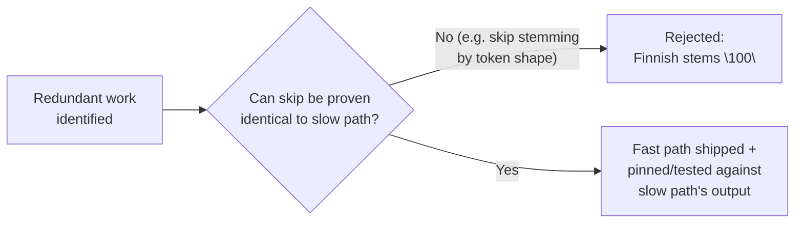
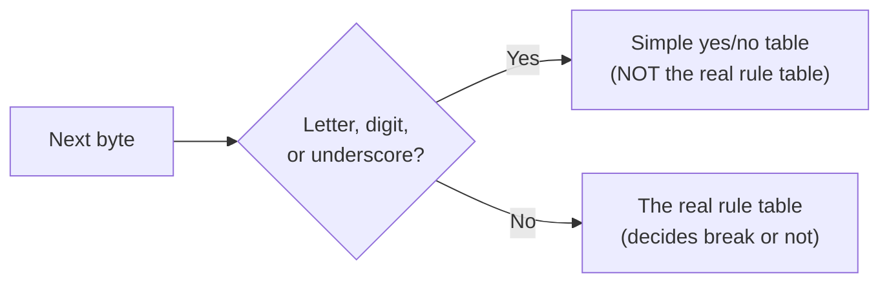

## Summary

If you're not sure what's actually happening to a string before reading this page, start with ["What happens to your data, in plain English"](../OVERVIEW.md#what-happens-to-your-data-in-plain-english) on the Overview. This page is about *why the fast versions of those steps are safe*, not what the steps are.

Alyze's performance work follows one rule, stated directly in the codebase's own writeup: *"not faster differently, faster identically."* Every fast path in the [Tokenizer](../modules/tokenizer.md) and [Analyzer](../modules/analyzer.md) is provably byte-identical to the slow path it bypasses. This matters because tokenization runs on both the write path and the query path: if a fast path drifted from the DFA's real output on even one edge case, a document that should match a query would silently fail to, with no error and no crash.

## The napkin math behind "fast"

"Fast" is meaningless without a unit, so here's one. [README.md](../../README.md)'s benchmark measures throughput in MiB/s over real English Wikipedia text; converted to time per average word (~5 bytes, including the space after it):

| Stage | Throughput | Time per word |
| --- | --- | --- |
| Just splitting into words | 529 MiB/s | ~9 nanoseconds |
| + lowercase | 375 MiB/s | ~13 nanoseconds |
| + drop filler words | 316 MiB/s | ~15 nanoseconds |
| + shrink to root (stemming) | 139 MiB/s | ~34 nanoseconds |
| + fold accents (everything on) | 134 MiB/s | ~36 nanoseconds |

A nanosecond is a billionth of a second. Even with every step turned on, the whole search phrase `"running shoes for men"` (21 characters) takes about **150 nanoseconds**, 0.00000015 seconds, to run through this entire pipeline. A response that "feels instant" to a person is usually budgeted around 100 milliseconds, about 650,000 times longer than that. This is the concrete number behind the SIMD design decision below: this code is a rounding error next to everything else that happens during a search.

The table also makes "stemming is the expensive stage" a measured fact, not an assertion: stemming alone (316 MiB/s → 139 MiB/s) costs more time than every other step combined (529 MiB/s → 316 MiB/s).

## Diagram

## Key components

Each cleanup step from [the plain-English walkthrough](../OVERVIEW.md#what-happens-to-your-data-in-plain-english) has the same trick applied to it: if there's nothing for that step to actually do to a given word, skip it instead of doing the work anyway.

- **ASCII fast-path scan** ([Tokenizer](../modules/tokenizer.md)), the "split into words" step; ~2× on English:

For a run of letters/digits/underscore, the real rule table would only ever answer "no break" anyway, so the simple table gives the identical result without asking it.
- **Lowercase short-circuit** ([Analyzer](../modules/analyzer.md)), the "lowercase it" step: if the word has no uppercase letters (`TokenProperties::has_ascii_upper()` is false), there's nothing to lowercase, so skip it instead of calling into Unicode case-mapping anyway.
- **ASCII-fold skip** ([Analyzer](../modules/analyzer.md)), the "fold accents to plain letters" step (`café` → `cafe`): if the word is already plain ASCII (`TokenProperties::is_ascii()` is true), there are no accents to fold, so skip it.
- **Stemming cache** ([Analyzer](../modules/analyzer.md)), the "stem it to its root" step (`running` → `run`): instead of skipping this step (which isn't safe, see Design decisions below), remember the answer for words already stemmed once, so repeats are free.

All four are gated by the same upstream signal: [`TokenProperties`](../concepts/token-properties-bitmask.md), computed once by the DFA and read by every filter downstream.

## Design decisions

- **Why not skip stemming for tokens that "look" unstemmable (e.g. pure digits)?** Tried and rejected: Finnish stems the string `"100"` to something else, so a shape-based skip is not identical to the real stemmer's output on every language. The only safe lever left was caching the real stemmer's result (the [stemming cache](../concepts/stemming-cache.md)), not skipping the call.
- **Why is the read path treated as latency-critical, not just the write path?** turbopuffer tokenizes unindexed data at query time for strong consistency: tokenization sits on the read critical path, not only ingestion. That rules out approximate or divergent tokenization outright: any drift between how a document was indexed and how a query is analyzed silently breaks matching.
- **Why is `tpuf_icu_properties_211` (the Unicode data crate) and the lowercasing table in [u17_to_lower.rs](../../src/analyze/u17_to_lower.rs) pinned rather than tracking upstream?** A Unicode Character Database version bump changes word-break/case-mapping decisions. If tokenization behavior can drift silently across a dependency update, the write-time/query-time consistency guarantee breaks. Pinning trades "free" upstream fixes for reproducibility.
- **Why is the crate not reaching for SIMD to go faster still?** Not covered by any single fast path above: the tokenizer is branchy, per-token, dependent work, not the wide data-parallel loop SIMD is good at, and on a cold query the wall-clock is dominated by pulling bytes from object storage, not the segmentation loop itself. Vectorizing it wouldn't move what a user actually feels. So the ceiling that matters is "least redundant work for identical output," not raw MiB/s. See [alyze: you can't make tokenization faster, only do less of it](../../alyze-technical-blog.md).

## Related

- [Tokenizer](../modules/tokenizer.md)
- [Analyzer](../modules/analyzer.md)
- [TokenProperties bitmask](../concepts/token-properties-bitmask.md)
- [Stemming cache](../concepts/stemming-cache.md)
- [Borrow until you can't](../concepts/borrow-until-you-cant.md)
- [Workspace & crate boundaries](./workspace-boundaries.md)
- [alyze: you can't make tokenization faster, only do less of it](../../alyze-technical-blog.md)