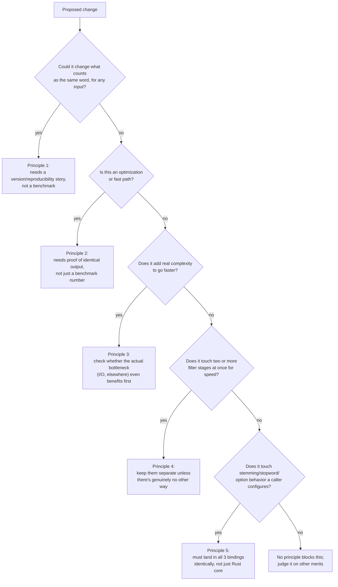

## Summary

One job, one constraint: alyze turns text into comparable terms so a search query and an indexed document agree on what counts as "the same word." Nothing else in this repo matters if that agreement ever breaks, even for one input. The five principles below exist to protect that constraint. Check a proposed change against these, not against "does it make things faster."

## Why the constraint is absolute

Search only works if the query and the document were tokenized the same way. turbopuffer additionally tokenizes at query time, not only when a document is written (see [Performance philosophy](./performance-philosophy.md)), so "the same way" has to hold across time too: a query run today has to agree with a document indexed months ago, using whatever version of this code happens to be running right now. One divergence, on one input, at one point in time, and a document that should match a query stops matching. Silently. No error, no crash.

## Key components

In plain terms: each of the five checks below is asking the same underlying question in a different spot: would this change make the same input produce a different output, now or later? Say yes to any one of them and it stops being a performance decision.

The five principles, in the order to check them:

1. **Byte-identical output beats speed.** If a change could alter the DFA's output, the `TokenProperties` bitmask, or a filter's result for any input, it's a correctness question, not a performance one. This is why Unicode data (`tpuf_icu_properties_211`) and the lowercasing tables are pinned to a fixed version instead of tracking upstream, and why the tokenizer runs against the official UAX #29 conformance suite (1944 word-break cases, zero failures) as a hard gate.
2. **A fast path must be provably identical, not "probably fine."** The ASCII scan skips the DFA only because the DFA's own rules can be shown to always say "no break" for the bytes it covers, not because it was benchmarked and looked okay. When a shortcut can't be proven identical (e.g. skipping stemming based on how a token looks: Finnish stems `"100"`), the fix is to cache the real computation, not skip it.
3. **Simplicity wins when it trades off against raw speed.** The tokenizer's own writeup explicitly declines to reach for SIMD: on a cold query the wall-clock is dominated by pulling bytes from object storage, not the tokenizer, so vectorizing it wouldn't move what a user actually feels. The ceiling that matters is "least work for identical output," not raw throughput. See [alyze: you can't make tokenization faster, only do less of it](../../alyze-technical-blog.md).
4. **Filters stay separate, individually toggleable stages.** Length limit, lowercase, stopwords, stemming, ASCII folding are five distinct steps in `AnalysisOptions`/`Analyzer`, each independently on or off, not one fused pass. A change that speeds things up by merging two filters' scans together works against this on purpose.
5. **Every language binding behaves identically, even at the cost of duplication.** wasm, node, and python each carry their own copy of the language-mapping tables rather than sharing one clever mechanism. Three duplicated tables that can't silently drift apart beat one shared abstraction that could.

## Design decisions

How to use this on an actual proposed change: walk the questions in order and stop at the first one that applies.

## Related

- [What happens to your data, in plain English](../OVERVIEW.md#what-happens-to-your-data-in-plain-english), the "one job" this page protects
- [Performance philosophy](./performance-philosophy.md), the deep dive on principles 1-3
- [Workspace & crate boundaries](./workspace-boundaries.md), why principle 5 means 3 separate crates instead of 1
- [Analyzer](../modules/analyzer.md), where principle 4's five stages actually live
- [alyze: you can't make tokenization faster, only do less of it](../../alyze-technical-blog.md)
