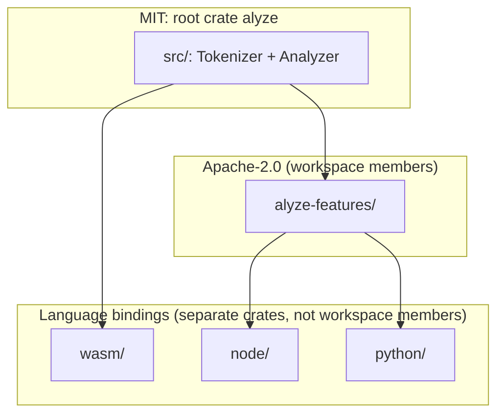

## Summary

Plain mental model first: this is one Rust codebase cut into five separate packages, each built and shipped on its own, but they all compile from the exact same source instead of five teams copying the logic five times.

More precisely: the repo is a Cargo workspace, split along two axes: **license** (MIT core vs. Apache-2.0 features) and **runtime** (native Rust vs. three FFI targets). Three of the five crates (`alyze`, `alyze-features`, `wasm`) are members of the root workspace and build from the same root [Cargo.toml](../../Cargo.toml) / [Cargo.lock](../../Cargo.lock); `node` and `python` depend on `alyze`/`alyze-features` by path but resolve their own dependencies in their own lockfiles. Either way, every language binding ships behavior compiled from identical `alyze` source: there is no re-implementation to drift.

## Diagram

## Key components

- [Tokenizer](../modules/tokenizer.md) + [Analyzer](../modules/analyzer.md): the root `alyze` crate ([Cargo.toml](../../Cargo.toml): `name = "alyze"`, MIT). Published on crates.io; the thing turbopuffer actually depends on for `word_v4`.
- [alyze-features](../modules/alyze-features.md): a `[workspace]` member (`members = ["wasm", "alyze-features"]` in the root manifest) but licensed separately: Apache-2.0, because its rank-feature formulas are derived from Vespa's reference implementation (Copyright Vespa.ai). It depends on `alyze` as an ordinary crate dependency, not specially privileged.
- [Bindings](../modules/bindings.md) (`wasm/`, `node/`, `python/`): each its own crate with its own `Cargo.toml` and its own lockfile (`node/Cargo.lock`, `python/Cargo.lock` exist separately from the root `Cargo.lock`), because each is built and published independently (an npm package, a PyPI wheel via maturin, a wasm bundle via `wasm/build.sh`) on its own release cadence. `wasm` is a workspace member (needs to build with the same toolchain settings); `node` and `python` are not. They aren't listed in the root `members`, and each declares its own empty `[workspace]` table (see their own `Cargo.toml` comments: "so the root `alyze` workspace's `cargo build`/`test` never pull in napi" / "...PyO3"), which makes each its own workspace root rather than something Cargo could fold into the parent. Net effect: `cargo build` at the repo root never needs the Node or Python toolchains installed.
- [testdata/WordBreakTest.txt](../../testdata/WordBreakTest.txt) + [benches/wikipedia.rs](../../benches/wikipedia.rs): not crates; `benches/` is a dev-only Criterion harness in the root crate (`[[bench]] name = "wikipedia"`), `testdata/` holds the official UAX #29 conformance suites, both excluded from the published crate (`exclude = ["testdata/", "benches/"]` in [Cargo.toml](../../Cargo.toml)).

## Design decisions

- **Why wasm wraps the Analyzer directly but node/python wrap alyze-features instead:** wasm powers a client-side "try it" widget where the point is showing raw tokenization/analysis behavior. node/python are built for re-ranking pipelines, where the interesting surface is the *feature scores*, not the tokens themselves, so they expose `Analyzed` + feature methods and treat the underlying `Analyzer` as an internal detail (see the node binding's own doc comment: "Only the feature layer is exposed; the underlying `alyze` analysis pipeline is an internal detail").
- **Why the license split is at the crate boundary, not file-by-file:** Apache-2.0 obligations (attribution, NOTICE) are far easier to satisfy per-crate than per-file, and it keeps `cargo package`/crates.io metadata unambiguous: `alyze` on crates.io is unambiguously MIT.
- **Why one workspace instead of independent repos:** a single `Cargo.lock` at the root pins the exact `alyze` commit every binding builds against, so "does the wasm binding tokenize identically to the Python binding" is true by construction rather than by discipline.

## Related

- [Tokenizer](../modules/tokenizer.md)
- [Analyzer](../modules/analyzer.md)
- [alyze-features](../modules/alyze-features.md)
- [Bindings](../modules/bindings.md)
- [Performance philosophy](./performance-philosophy.md)