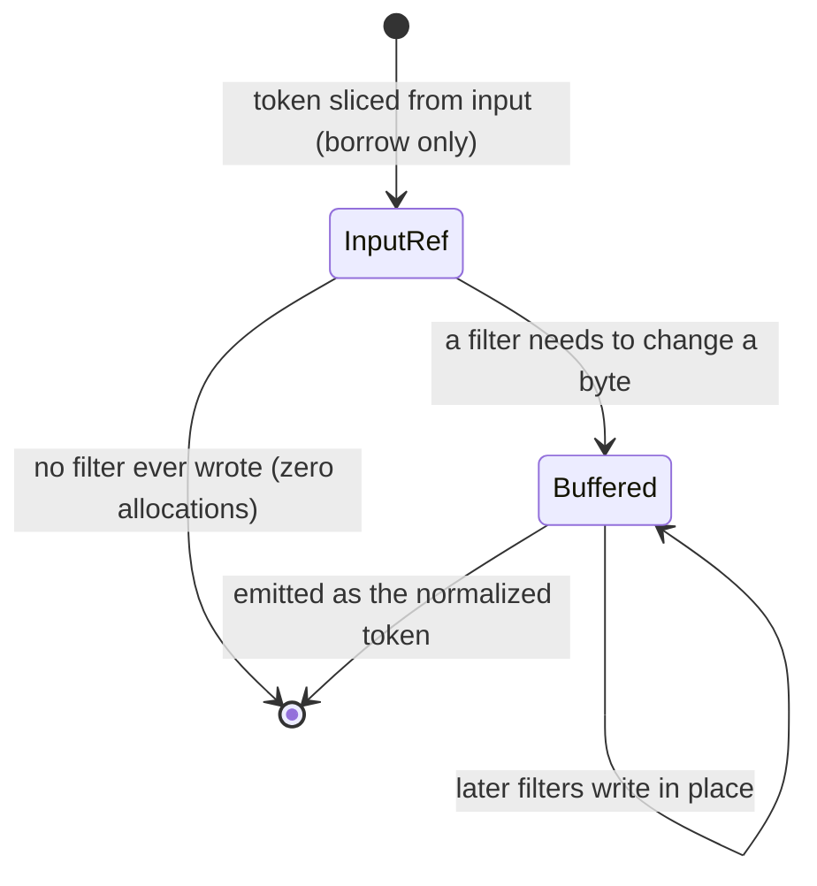

## Definition

A token starts life as a borrowed slice of the input string, and only copies itself into a scratch buffer at the exact moment some filter needs to change a byte. Modeled as an enum, `InputRefOrBuffered::InputRef { input: &str, .. }` or `::Buffered(&mut String)`, that transitions one-way from borrowed to buffered, never back.

## Why it matters

Most tokens in real text don't need every filter to actually change anything (an already-lowercase ASCII word skips lowercasing entirely; an ASCII word skips folding entirely). If every filter unconditionally allocated a new `String` "to be safe," that would be a copy per stage per token even when nothing changed. Instead, each filter method checks first whether it has real work to do, and only transitions the token to `Buffered` (via an unsafe in-place variant swap, since both enum arms hold only borrows, not owned data) the moment it must write new bytes. Net effect: an unmodified token allocates zero times across its entire trip through the pipeline, and the scratch buffers it does write into are reused across every call via [`ReusableBuffer`](../modules/analyzer.md).

## Where it lives

- [src/analyze/mod.rs](../../src/analyze/mod.rs): the `InputRefOrBuffered` enum and its `lowercase_in_place` / `stem_in_place` / `ascii_fold_in_place` / `transition_to_buffered` methods.

## Related

- [Analyzer](../modules/analyzer.md)
- [TokenProperties bitmask](./token-properties-bitmask.md)
- [Performance philosophy](../architecture/performance-philosophy.md)
- [Byte-range recovery](./byte-range-recovery.md)