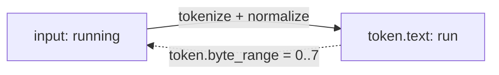

## Definition

You can always get back the exact original word as the user typed it, even after it's been lowercased, stemmed, or folded down to something else entirely. Every emitted `Token` carries a `byte_range: Range<usize>` indexing into the *original* input, not into its own (possibly normalized) `text`. Recover the untouched raw substring with `&input[token.byte_range]`, regardless of what lowercasing, stemming, or ASCII folding did to `token.text`.

## Why it matters

Normalization routinely changes a token's byte length: ASCII folding shrinks `"café"` (5 bytes) to `"cafe"` (4 bytes); stemming shrinks `"running"` (7 bytes) to `"run"` (3 bytes); lowercasing a Greek capital sigma can even change which code point is used (see `byte_range_recovers_raw_when_lowercasing_changes_char`). Without a separately-tracked `byte_range`, a caller that wants to highlight the original matched text in a search result, or report an offset back to a user, would have no way to recover it once the token had been normalized. Tracking it costs nothing extra: the [tokenizer](../modules/tokenizer.md) already knows the exact span before any filter touches it.

## Where it lives

- [src/analyze/mod.rs](../../src/analyze/mod.rs): `Token::byte_range` and `Token::input_index` (the latter identifies which input string, for `analyze_inputs` over multiple fields). Added per [CHANGELOG.md](../../CHANGELOG.md): "add `Token::byte_range` and `Token::input_index` to recover a token's raw source substring."
- Tests: `byte_range_recovers_raw_substring_when_normalized`, `byte_range_recovers_raw_when_ascii_folding_shrinks_bytes`, `byte_range_recovers_raw_when_stemming_shrinks_bytes` in the same file pin this behavior explicitly for each normalization stage.

## Related

- [Analyzer](../modules/analyzer.md)
- [Borrow until you can't](./borrow-until-you-cant.md)
- [Tokenize + analyze a string](../flows/tokenize-and-analyze.md)