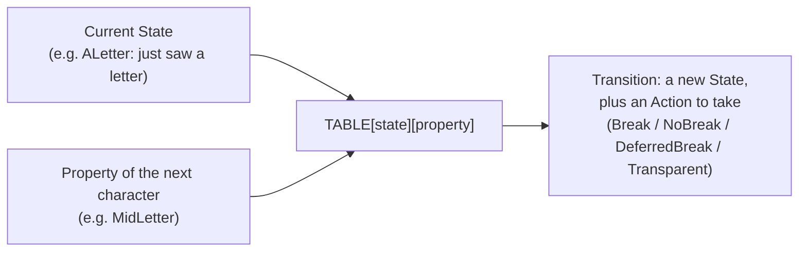

## Definition

The naive way to describe it: a lookup table that says whether to break here or not, for every combination of "where the scan currently is" and "what kind of character comes next." No rules get evaluated at runtime; the answer is already sitting in a table cell waiting to be read.

In the actual code, "where the scan currently is" is a `State` (there are 15 for word-boundary scanning, e.g. `ALetter` means "just saw a letter"), and "what kind of character comes next" is a `Property` (the character's Unicode Word_Break property, e.g. `MidLetter`). The table itself, `TABLE: [[Transition; NUM_PROPS]; NUM_STATES]`, maps every `(State, Property)` pair to exactly one `Transition(next_state, Action)`. Stepping the machine one character is one table lookup: no branching tree, no backtracking.

## Why it matters

It's the mechanism that makes [UAX #29](./uax29-boundaries.md) segmentation both correct and fast: the whole rule set compiles down to a table built once at compile time (`const fn`), and the runtime cost of applying it is a lookup plus a match on four `Action` variants (`Break`, `NoBreak`, `DeferredBreak`, `Transparent`). `DeferredBreak` in particular is how the DFA handles rules that need one character of lookahead (e.g. whether `'` in `can't` breaks depends on what follows it) without needing extra states for every lookahead combination.

## Where it lives

- [src/uax29/mod.rs](../../src/uax29/mod.rs): the `Action` enum and the `state_enum!`/`break_property_enum!` macros shared by both the word and sentence machines.
- [src/uax29/word/transitions.rs](../../src/uax29/word/transitions.rs), [src/uax29/sentence/transitions.rs](../../src/uax29/sentence/transitions.rs): the `State` enum, `Transition` struct, and the `TABLE` const itself for each machine.
- [src/uax29/word/mod.rs](../../src/uax29/word/mod.rs): the driver loop that steps the table and layers the ASCII fast path on top.

## Related

- [UAX #29 word/sentence boundaries](./uax29-boundaries.md)
- [TokenProperties bitmask](./token-properties-bitmask.md)
- [Tokenizer](../modules/tokenizer.md)