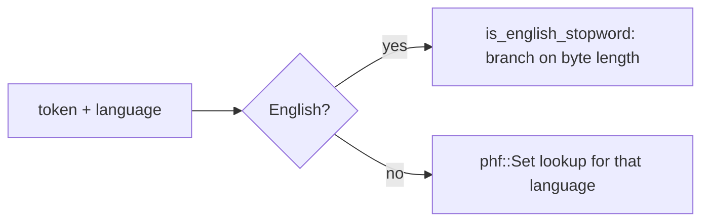

## Definition

A stopword list is just a fixed set of common words, "the", "a", "and", "of", that get dropped during analysis because they carry almost no search signal. Since the list never changes at runtime, alyze can look a token up instantly instead of building any kind of set at startup.

For most languages that lookup is a `phf::Set<&'static str>`: a set whose hash function and bucket layout are computed at *compile time* by the `phf` crate's proc-macro, for a fixed, known-in-advance set of strings (here, each language's stopword list). Lookup at runtime is one computed-hash-and-compare, with zero construction cost (no `HashSet::new()` + inserts at startup).

## Why it matters

Stopword lists are static data, so there's no reason to pay a runtime hash-set construction cost every time an `Analyzer` is built, or to accept a slower general-purpose collision strategy when the exact key set is known ahead of time. `phf` trades that away entirely: the perfect hash function is baked into the binary.

Twelve languages get their own `phf::Set` this way (Danish, Dutch, Finnish, French, German, Hungarian, Italian, Norwegian, Portuguese, Russian, Spanish, Swedish). English is the exception: it's handled by a hand-written `is_english_stopword` function in `filters.rs` that branches on token byte length and then the first couple of bytes, essentially a hand-rolled perfect-hash-by-length, skipping even the `phf` hash computation for the language that gets checked most often. That brings the total to thirteen languages with stopword support. Five more supported stemming languages (Arabic, Greek, Romanian, Tamil, Turkish) have no stopword list at all.

## Where it lives

- [src/analyze/stopwords.rs](../../src/analyze/stopwords.rs): one `pub const` `phf::Set` per language, vendored from Tantivy / the Snowball project (the English list traces back to Lucene's analyzer).
- [src/analyze/filters.rs](../../src/analyze/filters.rs): `is_stopword_in_language` dispatches to the right set based on `LanguageWithStopwords`.

## Related

- [Analyzer](../modules/analyzer.md)
- [Tokenize + analyze a string](../flows/tokenize-and-analyze.md)