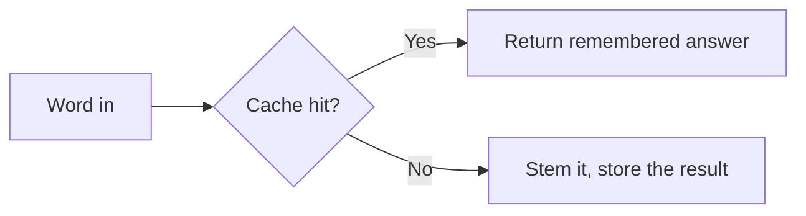

## Definition

It remembers the root of a word once it's figured that out, so it doesn't redo the same work for common words.

Concretely: a fixed-capacity (32,000-entry), never-evicting map from token to stemmed result, keyed by `ShortToken<10>` (a `[u8; 10]` + length, `Copy`, no heap allocation; tokens over 10 bytes simply aren't cached).

## Why it matters

Stemming is the one stage in the [analysis pipeline](../modules/analyzer.md) that can't be skipped or fast-pathed the way lowercasing/folding can: it's a call into a Snowball stemmer port (`rust_stemmers`), and the crate can't make that call itself faster. It was tempting to skip stemming for tokens that "look" unstemmable (e.g. pure digits), but that's unsafe: Finnish stems the string `"100"` to something else, so any shape-based skip isn't identical to the real stemmer's output across all 18 supported languages (see [Performance philosophy](../architecture/performance-philosophy.md)). The only safe lever left was caching the real result. Because word frequency in real text follows a power law (a small set of words dominates), a cache that never evicts and just stops accepting new entries once full still catches the vast majority of stemming calls, measured ~2× throughput on stemmed analysis. `StemmingCacheEntry::Unchanged` is its own variant (distinct from `Stemmed`), so a word that stems to itself costs zero copies on a cache hit, not just zero stemmer calls.

## Where it lives

- [src/analyze/stemming_cache.rs](../../src/analyze/stemming_cache.rs): `StemmingCache`, `StemmingCacheEntry`, `ShortToken<N>`.
- [src/analyze/mod.rs](../../src/analyze/mod.rs): `ReusableBuffer` owns one `StemmingCache` (capacity 32,000) and `InputRefOrBuffered::stem_in_place` is the lookup/insert call site.

## Related

- [Analyzer](../modules/analyzer.md)
- [Performance philosophy](../architecture/performance-philosophy.md)
- [Borrow until you can't](./borrow-until-you-cant.md)