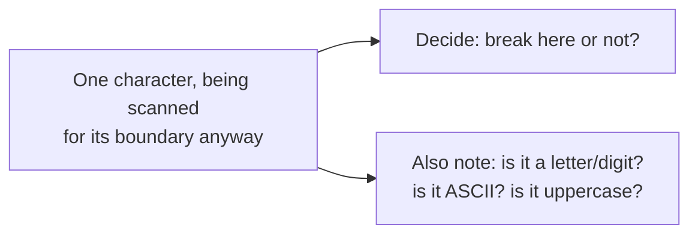

## Definition

A few yes/no notes about a word, figured out while splitting it out, so nothing downstream has to re-check the text later: is it word-like, is it plain ASCII, does it contain an uppercase ASCII letter.

Concretely, it's a `u8` bitmask (`WORD_LIKE`, `NON_ASCII`, `HAS_ASCII_UPPER`) that the [DFA](./dfa-state-machine.md) accumulates for a token as a side effect of the boundary scan it's already doing, with no extra pass over the text. Emitted alongside every token boundary as `TokenProperties`.

## Why it matters

It's the single signal that every downstream [Analyzer](../modules/analyzer.md) fast path reads: skip lowercasing when `!has_ascii_upper()`, skip ASCII folding when `is_ascii()`, skip stopword/stemming checks entirely when `!is_word_like()`. None of those filters have to re-scan the token to decide whether they have work to do; the DFA already knew, for free, while it was walking the text anyway. This is the concrete mechanism behind ["faster identically, not faster differently"](../architecture/performance-philosophy.md): the properties are computed by the same scan that produces the boundary, so nothing downstream can disagree with what the DFA actually saw.

The one sharp edge worth internalizing: properties are stored disjunctively and reset per-token, but a *breaking* character's properties belong to the token it starts, not the one it ends: `"ab🛑"` must report `ab` as ASCII and `🛑` as non-ASCII. Getting this backwards doesn't crash; it silently routes ASCII tokens down the slow path (or vice versa), which is exactly the kind of bug [performance philosophy](../architecture/performance-philosophy.md) is written to prevent; it's pinned down by dedicated tests (`tokenizer_properties_sanity`, `tokenizer_has_ascii_upper_sanity`) rather than left to code review.

## Where it lives

- [src/uax29/word/mod.rs](../../src/uax29/word/mod.rs): the `TokenProperties` struct, its bit constants, and the ASCII fast-path tables (`ASCII_BYTE_INFO`, `WORD_BREAK_CONTRIB`) that compute it cheaply.

## Related

- [DFA state machine](./dfa-state-machine.md)
- [Tokenizer](../modules/tokenizer.md)
- [Borrow until you can't](./borrow-until-you-cant.md)
- [Performance philosophy](../architecture/performance-philosophy.md)