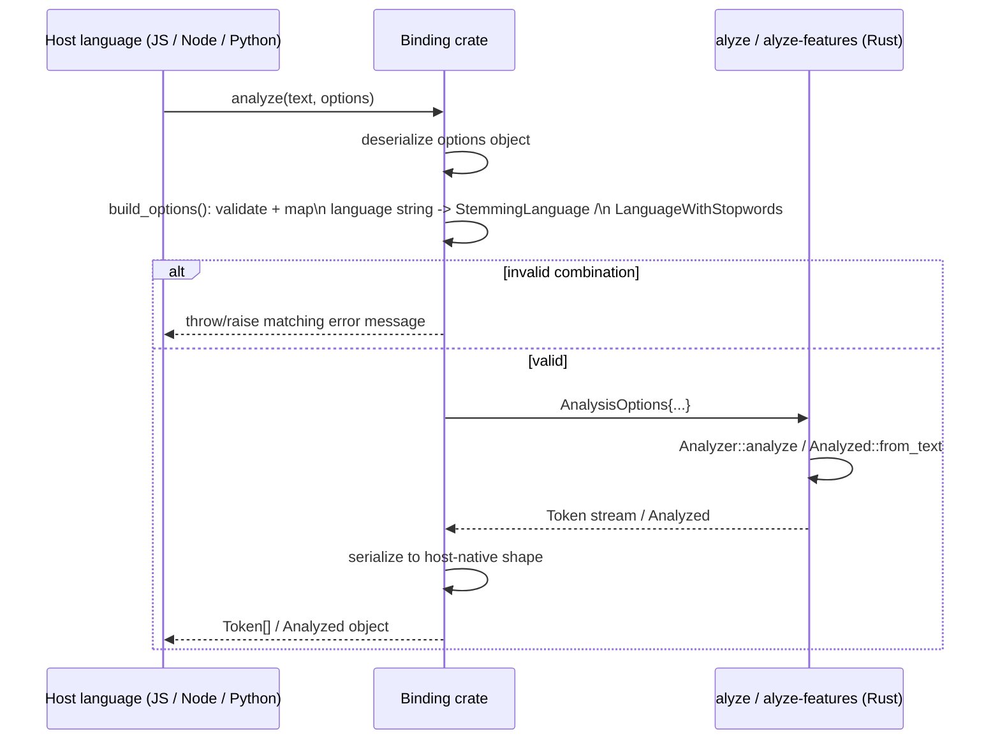

## Summary

In plain terms: you call this from JS, Node, or Python like any normal function; it checks your options make sense, does the real work in Rust, and hands you back a normal-looking result in your own language. Technically, all three [bindings](../modules/bindings.md) share one shape: validate the host language's options into a Rust `AnalysisOptions`, run the exact same core Rust code, then adapt the result back to whatever the host language expects. The validation logic is duplicated three times (once per binding) rather than shared, so this flow calls out where that duplication lives and why it's safe.

## Trigger

A host-language call: `analyze(text, options)` (wasm), `new Analyzer(options).analyze(text)` (node), or `Analyzer(...).analyze(text)` (python).

## Sequence diagram

## Steps

1. **Deserialize the host option object.** wasm uses `serde_wasm_bindgen` into a `#[derive(Deserialize)] struct Options` (with `deny_unknown_fields`, so a typo'd JS field is a hard error); node uses a `#[napi(object)] struct AnalyzerOptions`; python uses `#[pyo3(signature = (...))]` keyword arguments directly.
2. **Validate, mirroring the turbopuffer API's own rules.** Each binding's `build_options` function independently re-checks: stemming/stopword-removal require `case_sensitive: false`; the `language` string must support the requested feature; `max_token_length` must be in `1..=255`. Error message text is written to match what the turbopuffer API itself returns for the same misconfiguration.
3. **Map the language string to the core enums.** Each binding has its own `stemming_language(&str) -> Option<StemmingLanguage>` and `stopword_language(&str) -> Option<LanguageWithStopwords>`: three separate copies of the same match arms (see [Add a stemming/stopword language](../guides/add-a-language.md) for what that means when adding a language).
4. **Call into the shared Rust core.** wasm calls [`Analyzer::analyze`](../modules/analyzer.md) directly; node/python call [`alyze_features::Analyzed::from_text`](../modules/alyze-features.md), which itself wraps `Analyzer::analyze`.
5. **Adapt the result to the host shape.** wasm serializes a `Vec<Token>` (plain struct) to a JS array via `serde_wasm_bindgen`, a one-shot conversion with nothing left resident afterward. node/python instead return a persistent `Analyzed`-wrapping object (`#[napi]`/`#[pyclass]`): the tokenized data stays resident in Rust, so a later feature call (`query.fieldMatch(document)`) only has to pass a handle to already-tokenized text across the FFI boundary, instead of re-tokenizing or re-serializing the text on every call.

## Failure modes

- **The three language-mapping tables can drift.** Nothing enforces that wasm's, node's, and python's `stemming_language`/`stopword_language` match arms stay in sync with each other or with the core `StemmingLanguage`/`LanguageWithStopwords` enums. Adding a language to the core enum without updating all three bindings leaves that language silently unsupported in whichever binding was missed (it returns the "not supported for language" error, not a compile failure).
- **`Analyzer` held across threads** (node/python): both wrap the analyzer's `ReusableBuffer` in a `Mutex` because the host runtime can call in from multiple threads; a poisoned mutex (from a prior panic mid-analysis) turns every subsequent call into a hard `expect` panic rather than a recoverable error.
- **wasm has no persistent `Analyzer` object.** Every `analyze()` call builds a fresh `ReusableBuffer`, so the [stemming cache](../concepts/stemming-cache.md) never warms up across calls in the wasm binding the way it does in node/python. This is a deliberate scope difference (wasm targets a one-off "try it" widget, not a batch re-ranking loop), not a bug, but it means wasm's throughput characteristics differ from the other two bindings.

## Related

- [Bindings](../modules/bindings.md)
- [Analyzer](../modules/analyzer.md)
- [alyze-features](../modules/alyze-features.md)
- [Add a stemming/stopword language](../guides/add-a-language.md)
- [Compute a rank feature](./compute-rank-feature.md)