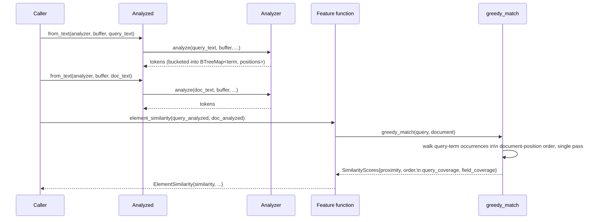
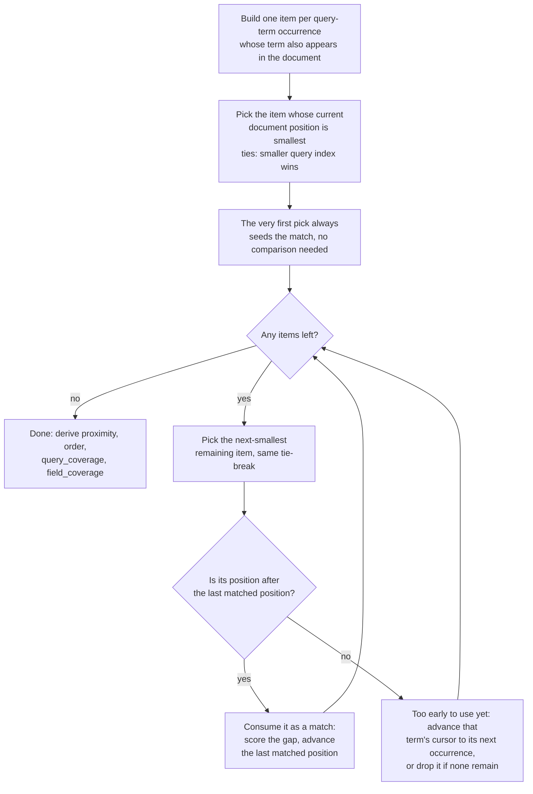

## Summary

How [alyze-features](../modules/alyze-features.md) turns a query and a candidate field into re-ranking signals: analyze both once, bucket into position maps, then run one shared positional-matching algorithm that every similarity/completeness feature reads from.

## Trigger

A re-ranker (via the [node or python binding](../modules/bindings.md), or the Rust crate directly) calls a feature function such as `element_similarity(query, document)`, `field_match(...)`, or `text_similarity(query, document)`.

## Sequence diagram

## Steps

In plain terms: the whole flow is about comparing where words show up in the query to where those same words show up in the field, then turning "how close together," "in what order," and "how much overlaps" into a handful of numbers a re-ranker can use.

1. **Analyze once per side.** `Analyzed::from_text` runs the query string and the field string each through the same [Analyzer](../modules/analyzer.md) (same config; matching config on both sides is what makes term comparison valid at all, per the tokenizer's core contract). Each side's result is bucketed into a `BTreeMap<String, Vec<usize>>`: term to sorted positions.
2. **Reuse `Analyzed` across every feature.** The expensive tokenize+normalize step happens exactly once per (query, field) pair; every feature function called afterward reads from the same two maps.
3. **Simple features read the maps directly.** `element_completeness` just counts overlap between the two token maps; no positional matching needed.
4. **Positional features call the shared `greedy_match`.** In plain terms: line up each query word with where it actually shows up in the field, then score how tight together and how in-order that lineup is. `element_similarity` and `text_similarity` both call the same private `greedy_match(query, document)` to do this: it walks query-term occurrences that also exist in the document, in document-position order, greedily consuming each query term at most once. This produces `proximity`, `order`, `query_coverage`, `field_coverage`: the shared building blocks both features blend with different weights.
5. **`FieldMatch` computes the same shape at higher resolution.** The `field_match` family runs a related segment-based positional analysis (segments, gaps, head/tail, longest run) and additionally folds in `TermStats` (document frequency / corpus size) for the IDF-dependent outputs, when the caller supplies them.
6. **Return a small `Copy` result, no allocation.** Most feature functions return a small `Copy` struct of `f64` fields (`ElementCompleteness`, `ElementSimilarity`, `TextSimilarity`, `FieldMatch`, `FieldTermMatch`); a couple (`matches`, `query_term_count`) just return a bare `f64`. Either way nothing is allocated, so it's easy to serialize straight across the [node/python FFI boundary](../modules/bindings.md).

### The `greedy_match` walk, step by step

Step 4's algorithm in one picture: `greedy_match` builds one item per query-term occurrence whose term also appears in the document, then repeatedly picks the item sitting at the smallest remaining document position and either consumes it as a match or skips ahead.

## Failure modes

- **Query and field analyzed with different configs.** Nothing in the type system prevents passing `Analyzed` instances built from two different `Analyzer`s. If they were configured differently (e.g. one case-sensitive, one not), terms silently fail to line up and every feature quietly returns low/zero scores instead of erroring.
- **Stopword removal or a token-length cap on either side** introduces position gaps. `greedy_match` (used by `element_similarity`/`text_similarity`) stores real token positions, so gaps don't break it. `field_match` is the one that's fragile here: it works off `Analyzed::ordered_tokens()`, whose own doc comment says it assumes contiguous positions (no gaps), which holds only when the analysis config has no stopword removal, because it treats each token's index in that list as its field position. If either side actually has gaps, `field_match`'s segment/gap arithmetic ends up measuring the wrong distances. Leave stopword removal and the length cap off, as the crate's own tests do, to avoid this.
- **`TermStats` omitted.** `FieldMatch`'s IDF/weight-dependent outputs fall back to `TermStats::default()` (neutral significance 0.5, weight 100), which is a silent degradation, not an error, if the caller forgot to supply real corpus statistics.

## Related

- [alyze-features](../modules/alyze-features.md)
- [Analyzer](../modules/analyzer.md)
- [Greedy positional matching](../concepts/greedy-positional-match.md)
- [Tokenize + analyze a string](./tokenize-and-analyze.md)
- [A binding call, host language to Rust and back](./binding-call.md)