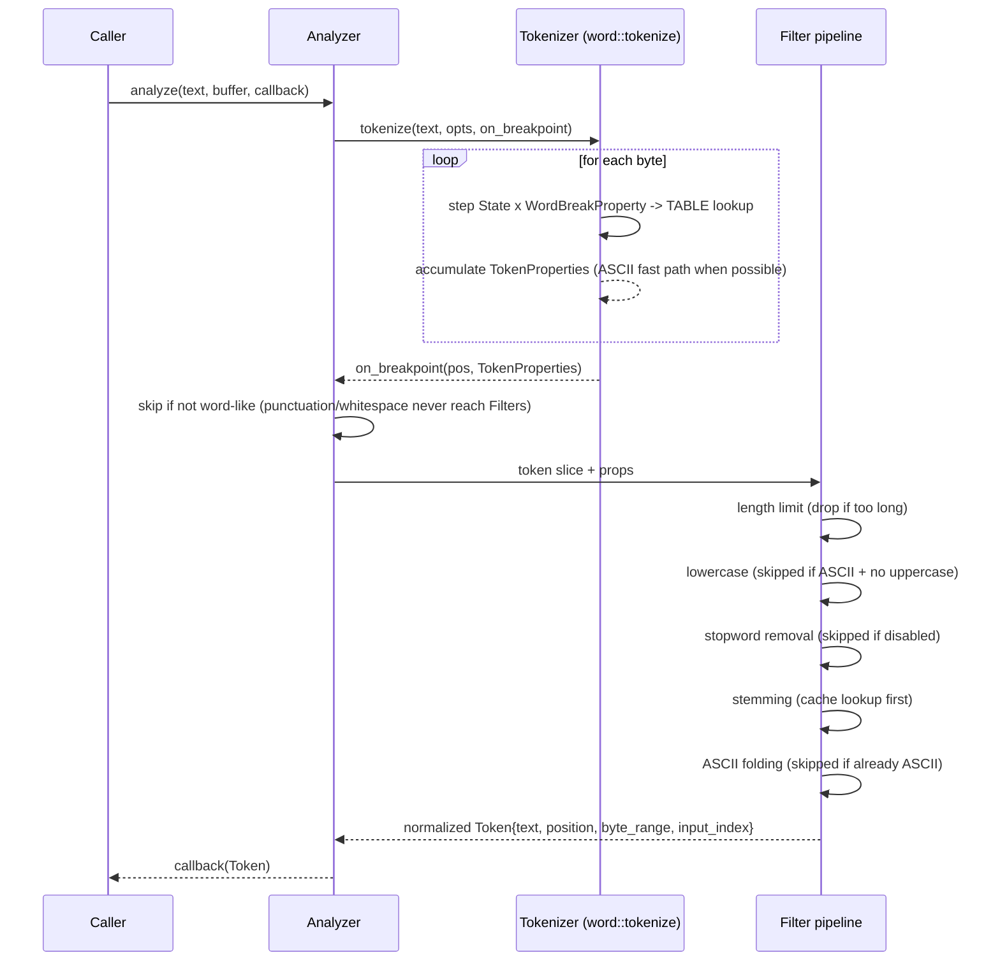

## Summary

In plain terms: you hand this a string of text, and word by word, clean and normalized search terms come back out. Technically, this is the single most-traveled path in the codebase: a caller hands `Analyzer::analyze` a string and a reusable buffer, and gets back a stream of normalized `Token`s via callback. Every other entry point (the [wasm binding](../modules/bindings.md), the [benchmark harness](../../benches/wikipedia.rs), [alyze-features](../modules/alyze-features.md)) is a thin wrapper around this flow.

## Trigger

A call to `Analyzer::analyze(text, &mut buffer, callback)` or `Analyzer::analyze_inputs(texts, &mut buffer, callback)`, in [src/analyze/mod.rs](../../src/analyze/mod.rs).

## Sequence diagram

Two machines hand off exactly once per word: the tokenizer decides where a word ends, then the analyzer cleans that word up before handing it back to the caller.

## Steps

Each word runs down the same fixed assembly line: figure out where it starts and ends, throw it out immediately if it isn't a real word, then clean it up one filter at a time before handing it back.

1. **Tokenize.** `Analyzer::analyze_inputs` drives [`uax29::word::tokenize`](../modules/tokenizer.md), which walks the DFA byte-by-byte using the ASCII fast path where possible, and invokes `on_breakpoint(pos, TokenProperties)` at every word boundary.
2. **Skip non-word tokens early.** The breakpoint callback in `mod.rs` immediately returns `true` (skip) for spans where `!props.is_word_like()`: punctuation and whitespace never enter the filter pipeline at all.
3. **Assign position, slice the raw span.** A word-like token gets the next monotonic `position` (see [Token position monotonicity](../concepts/token-position-monotonicity.md)) and is sliced from the input as a borrow (`InputRefOrBuffered::InputRef`); see [Borrow until you can't](../concepts/borrow-until-you-cant.md).
4. **Length filter.** `filters::within_token_length_limit` drops the token if it exceeds `maximum_token_length` (before any normalization work is spent on it).
5. **Lowercase.** Skipped only when the token is plain ASCII with no uppercase byte (`TokenProperties::is_ascii()` true and `has_ascii_upper()` false), or when `case_sensitive` is set; otherwise `lowercase_in_place` transitions the token to a buffered copy. A non-ASCII token is always lowercased here even if it contains no ASCII uppercase byte, since `has_ascii_upper` only tracks ASCII.
6. **Stopword removal.** `filters::is_stopword_in_language` looks up the (already-lowercased) token in the configured language's `phf::Set`; see [Perfect-hash stopword sets](../concepts/perfect-hash-stopwords.md). A hit drops the token (but its position was already consumed in step 3).
7. **Stemming.** `stem_in_place` checks the [stemming cache](../concepts/stemming-cache.md) first; on a miss it calls into `rust_stemmers` and inserts the result if the cache has room.
8. **ASCII folding.** Only runs when `ascii_folding` is enabled in `AnalysisOptions` and `TokenProperties::is_ascii()` is false; folds accented/non-ASCII characters to an ASCII equivalent, then re-lowercases if folding produced uppercase output (and case folding is enabled).
9. **Emit.** The final `Token{ text, position, byte_range, input_index }` goes to the caller's callback. Returning `false` from the callback stops analysis early (checked after every emitted token, not just at the end).

## Failure modes

Three ways this can go wrong, loudest to quietest: a bad config panics right away, a subtle miscategorization slips through silently, and stale reused memory only misbehaves in debug builds.

- **Invalid option combination never reaches this flow at all.** `Analyzer::new` asserts `AnalysisOptions::valid()` (stemming/stopwords require `case_sensitive: false`), so a misconfigured analyzer panics at construction, not partway through analysis.
- **A fast-path bug silently mis-routes a token down the wrong path** rather than crashing, e.g. the `TokenProperties` "breaking char belongs to the next token" edge case (see [TokenProperties bitmask](../concepts/token-properties-bitmask.md)). This class of bug is caught only by the conformance test suites and property-specific unit tests, never at runtime.
- **Cache/scratch buffer reuse across calls.** `ReusableBuffer` must be reused correctly (its scratch strings assumed empty at the start of each filter step, enforced with `debug_assert!`); passing a buffer still "dirty" from an unrelated use is a logic error only caught in debug builds.

## Related

- [Tokenizer](../modules/tokenizer.md)
- [Analyzer](../modules/analyzer.md)
- [TokenProperties bitmask](../concepts/token-properties-bitmask.md)
- [Borrow until you can't](../concepts/borrow-until-you-cant.md)
- [Stemming cache](../concepts/stemming-cache.md)
- [Compute a rank feature](./compute-rank-feature.md)