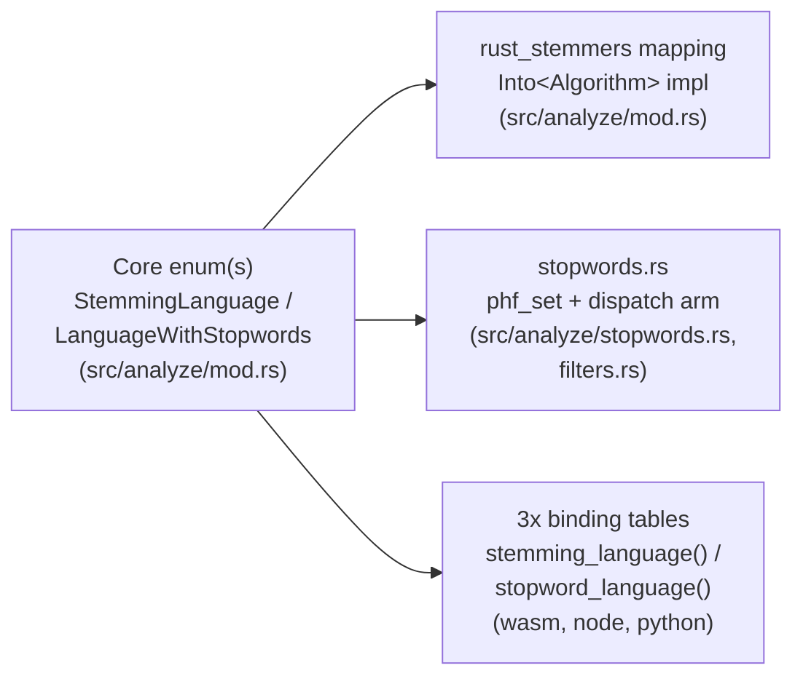

## Goal

Add stemming and/or stopword support for a new language, correctly, across every place that language name appears: the core crate and all three bindings.

## The four touch points

A language name has to be added in up to four places (a stopword-only or stemming-only language touches fewer):

## Steps

1. **Add a variant to the core enum(s).** `StemmingLanguage` (for stemming) and/or `LanguageWithStopwords` (for stopword removal) in [src/analyze/mod.rs](../../src/analyze/mod.rs), only if `rust_stemmers::Algorithm` actually supports the language (stemming) or a stopword list exists to vendor in (stopwords).
2. **Wire the stemming variant into `rust_stemmers`.** Add an arm to the `Into<rust_stemmers::Algorithm> for StemmingLanguage` impl in the same file.
3. **Vendor the stopword list, if adding one.** Add a new `pub const <LANGUAGE>: phf::Set<&'static str> = phf::phf_set! { ... };` to [src/analyze/stopwords.rs](../../src/analyze/stopwords.rs) (see [Perfect-hash stopword sets](../concepts/perfect-hash-stopwords.md)), then add the dispatch arm in `filters::is_stopword_in_language`.
4. **Update all three bindings' language tables.** This is the step most likely to be missed: [wasm/src/lib.rs](../../wasm/src/lib.rs), [node/src/lib.rs](../../node/src/lib.rs), and [python/src/lib.rs](../../python/src/lib.rs) each have their own `stemming_language(&str) -> Option<StemmingLanguage>` and `stopword_language(&str) -> Option<LanguageWithStopwords>` functions, with independent string-literal match arms: add the new language's string key to all three, in all applicable functions. wasm additionally lists every language (with capability flags) in its `LANGUAGES` const, used by the `languages()` API.
5. **Run the conformance and unit tests.** No stemming-specific fixture exists per language beyond `rust_stemmers`' own correctness, but re-run the full test suite (`cargo test`) to catch anything the new enum variant's exhaustive `match`es flag as missing (Rust will refuse to compile an unhandled variant in the `Into<Algorithm>` impl and the filter dispatch).

## Relevant code

- [src/analyze/mod.rs](../../src/analyze/mod.rs): `StemmingLanguage`, `LanguageWithStopwords`, the `Into<rust_stemmers::Algorithm>` impl
- [src/analyze/stopwords.rs](../../src/analyze/stopwords.rs), [src/analyze/filters.rs](../../src/analyze/filters.rs): stopword sets + dispatch
- [wasm/src/lib.rs](../../wasm/src/lib.rs), [node/src/lib.rs](../../node/src/lib.rs), [python/src/lib.rs](../../python/src/lib.rs): each binding's own `stemming_language`/`stopword_language`/`LANGUAGES`

## Gotchas

- **The three bindings' language tables are hand-duplicated, not generated from the core enum.** Nothing fails to compile if you add a language to the core `StemmingLanguage` enum but forget to add its string key to, say, the python binding: that binding just returns its "stemming is not supported for language: X" runtime error for a language the core crate actually supports. See [A binding call, host language to Rust and back](../flows/binding-call.md).
- **Stemming support and stopword support are independent.** A language can have one, both, or neither: 5 of the 18 stemming languages (Arabic, Greek, Romanian, Tamil, Turkish) have no stopword list at all. Don't assume adding one implies the other.
- **`AnalysisOptions::valid()` still requires `case_sensitive: false`** for both stemming and stopword removal, regardless of language; that invariant doesn't change per language.

## Related

- [Analyzer](../modules/analyzer.md)
- [Bindings](../modules/bindings.md)
- [Perfect-hash stopword sets](../concepts/perfect-hash-stopwords.md)
- [A binding call, host language to Rust and back](../flows/binding-call.md)