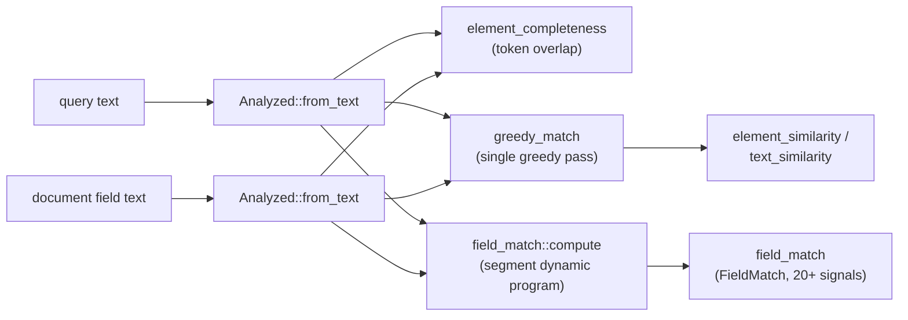

## Summary

**Naive model first:** you already have a query and a document that matched it (that part happened elsewhere); the question here is *how well* they match, not just *whether* they do, so several equally-"matching" documents can be sorted best-first. This crate answers that by comparing where the query's words land in the document: are they there at all, close together, in the same order, covering most of the query? Those comparisons are what the feature names below (`fieldMatch`, `elementCompleteness`, `elementSimilarity`, `textSimilarity`...) each measure.

A separate, Apache-2.0 workspace member that computes query/document text-match ranking signals (`fieldMatch`, `elementCompleteness`, `elementSimilarity`, `textSimilarity` and friends) for a second-stage re-ranker. It mirrors [Vespa's rank features](https://docs.vespa.ai/en/reference/ranking/rank-features.html) so the same signals are available client-side, computed from an [Analyzer](./analyzer.md)-produced token map rather than by calling back into the search backend. Lives in [alyze-features/src/lib.rs](../../alyze-features/src/lib.rs) (a single ~1450-line file).

The two branches on the right are genuinely different algorithms, not two views of the same computation: `greedy_match` is a single greedy pass over positions (used by `elementSimilarity`/`textSimilarity`), while `field_match` searches for the best segmentation via a small dynamic program (see [`FieldMatch`](#fieldmatch-librs) below).

## Responsibilities

- Turning a query string and a field string into comparable term-position maps (`Analyzed`).
- Computing completeness features (how much of the query is in the field, and vice versa).
- Computing similarity/proximity features via a shared greedy positional match between query and field terms.
- Computing the detailed `fieldMatch` family: segment-based positional statistics plus IDF/weight-dependent signals, for callers that supply corpus statistics.

## Public API / entry points

- `Analyzed::from_text(analyzer: &Analyzer, buffer: &mut ReusableBuffer, text: &str) -> Analyzed`: the entry point every feature function takes its two arguments from (call once per query, once per field).
- `element_completeness(query, document) -> ElementCompleteness`
- `element_similarity(query, document) -> ElementSimilarity`
- `text_similarity(query, document) -> TextSimilarity`
- `matches(query, document) -> f64`: binary any-term-matched flag.
- `field_term_match(query, document, term_index) -> FieldTermMatch`: per-query-term position/occurrence lookup.
- `query_term_count(query) -> f64`
- `field_match(query, document, stats: impl Fn(&str) -> TermStats) -> FieldMatch`: the detailed `fieldMatch` family (20+ signals, see [`FieldMatch`](#fieldmatch-librs) below); pass `|_| TermStats::default()` when only the positional outputs are needed.
- `legacy_significance(document_frequency, document_count) -> f64` and `TermStats::significance()`: IDF, normalized to `[0.5, 1]` against a fixed reference corpus size so it matches the search backend's definition exactly.

## Key files

- [alyze-features/src/lib.rs](../../alyze-features/src/lib.rs): everything: `Analyzed`, every feature function, every result struct, the shared `greedy_match` helper.
- [alyze-features/README.md](../../alyze-features/README.md): Apache-2.0 licensing note (`LICENSE` alongside it; the rest of the workspace is MIT). Features are derived from Vespa, Copyright Vespa.ai.

## Key data structures

### `Analyzed` (lib.rs)

The shared input type every feature function takes two of (query, document): a `BTreeMap<String, Vec<usize>>` from normalized term to sorted list of positions it occurs at. Built once via `from_text` (runs the [Analyzer](./analyzer.md) and buckets its output), then reused across every feature computed for that query/field pair, so the expensive tokenize+normalize step happens exactly once regardless of how many features are pulled from it. `token_at_position` and `ordered_tokens` reconstruct position-ordered views on demand from the map.

### `ElementCompleteness` / `ElementSimilarity` / `TextSimilarity` (lib.rs)

Small `Copy` result structs, one per feature family, each holding a headline score plus its components (e.g. `ElementSimilarity` holds `similarity` plus the `proximity`/`order`/`query_coverage`/`field_coverage` it's blended from). `element_similarity` and `text_similarity` are numerically identical for a single-value field: both are thin wrappers around the same private `greedy_match`.

### `SimilarityScores` (lib.rs, private)

The shared internal result of `greedy_match`: `proximity`, `order`, `query_coverage`, `field_coverage`. `greedy_match` processes query-term occurrences in document-position order, matching each to its first not-yet-consumed document occurrence after the previous match: a single-pass greedy algorithm, not full alignment, matching Vespa's own approach.

### `FieldTermMatch` (lib.rs)

Per-query-term-per-field result: `first_position` (or the `1_000_000.0` absent sentinel) and `occurrences`. One instance per `(term_index, field)` pair, looked up by query term ordinal via `Analyzed::token_at_position`.

### `TermStats` (lib.rs)

The caller-supplied corpus statistics a subset of `FieldMatch`'s outputs need: `document_frequency`, `document_count`, `weight` (percent, default 100). Its `significance()` derives IDF from `document_frequency`/`document_count` via `legacy_significance`, which projects the term's df/count ratio onto a *fixed* reference corpus size of 1,000,000, deliberately not the real corpus size, so significance depends only on frequency ratio and matches the search backend's own hardcoded formula bit-for-bit.

### `FieldMatch` (lib.rs)

The largest result struct in the crate, with over 20 fields covering the full Vespa `fieldMatch` output: `score`, three proximity variants, completeness, `orderness`, `relatedness`, `earliness`, longest-sequence stats, segment stats (count/distance/proximity), gap stats, `head`/`tail`, and (when `TermStats` is supplied) `significance`- and `weight`-derived signals. It is *not* built from `greedy_match`: the private `field_match` submodule runs its own, more elaborate algorithm, a small dynamic program that searches for the best way to split the matched terms into segments (see the diagram in the Summary above), which is why `FieldMatch` exposes so much more intermediate detail than the similarity structs.

## Dependencies

- [Analyzer](./analyzer.md): `Analyzed::from_text` is a thin wrapper around `Analyzer::analyze`; this crate does no tokenization or normalization of its own.
- `std::collections`: `BTreeMap` (for `Analyzed`'s term-position map; ordered iteration is relied on for position-sorted term output) and `BTreeSet` (for term dedup inside `field_match`) are the only external dependencies of note.

## Participates in

- Wrapped by the [node](./bindings.md) and [python](./bindings.md) bindings: both use an `Analyzer` to produce an `Analyzed`, then attach this crate's feature functions directly as methods on `Analyzed` (`elementSimilarity`, `fieldMatch`, ...), which is their primary public surface (unlike the wasm binding, which only wraps the raw `Analyzer`).

## Related

- [Analyzer: filter pipeline](./analyzer.md)
- [Tokenizer: UAX #29 word/sentence segmentation](./tokenizer.md)
- [Bindings (wasm / node / python)](./bindings.md)