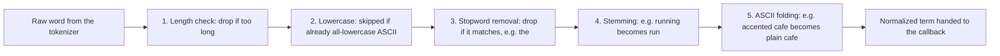
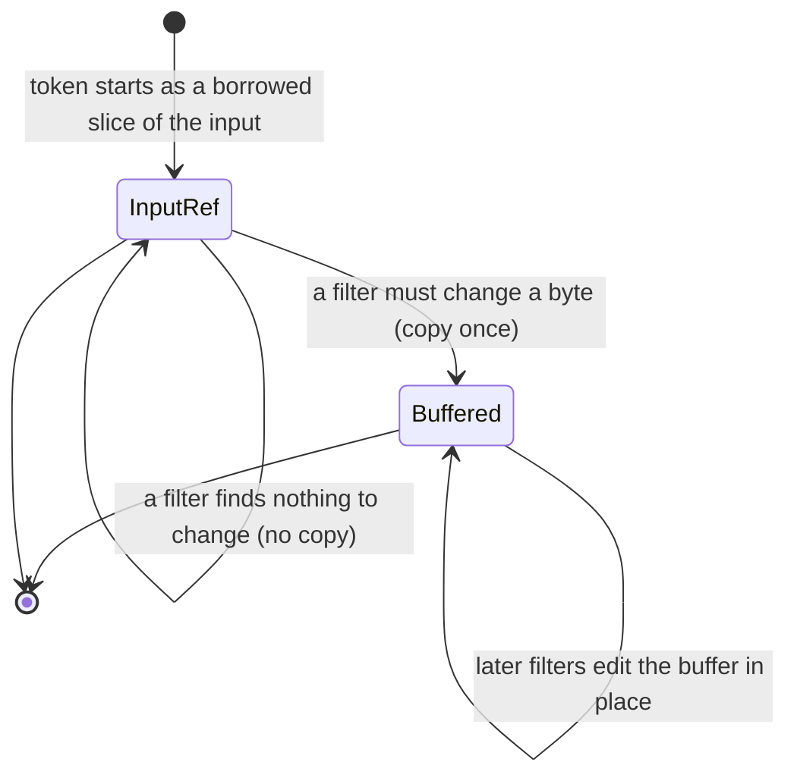

## Summary

The Analyzer sits directly on top of the [Tokenizer](./tokenizer.md): it drives `word::tokenize`, and for each word-like token runs a gated pipeline of normalizing filters (length limit → lowercase → stopword removal → stemming → ASCII folding) to turn raw substrings into the canonical terms search matches against. Lives in `src/analyze/` ([mod.rs](../../src/analyze/mod.rs), [filters.rs](../../src/analyze/filters.rs), [stemming_cache.rs](../../src/analyze/stemming_cache.rs), [stopwords.rs](../../src/analyze/stopwords.rs), [u17_to_lower.rs](../../src/analyze/u17_to_lower.rs)).

**Naive model first:** this is [steps 2 and 3](../OVERVIEW.md#what-happens-to-your-data-in-plain-english) from the plain-English walkthrough: drop punctuation first, then clean up each remaining word (cut if too long, lowercase, drop stopwords, stem to a root, fold accents). Each bullet below is one of those checks, plus a reason it can sometimes be skipped for a given word.

## Responsibilities

- Configuring which filters run and in what order, validated up front (`AnalysisOptions::valid()` rejects e.g. stemming combined with case-sensitivity).
- Driving the tokenizer and turning its breakpoints + `TokenProperties` into `Token`s (text, position, byte range, input index).
- Applying each filter stage only when the token's `TokenProperties` say it's needed: e.g. skip lowercasing entirely when the token is already all-lowercase ASCII.
- Minimizing allocations across a whole document/corpus via `ReusableBuffer`, reused scratch buffers, and copy-on-write semantics (`InputRefOrBuffered`): a token stays a borrowed slice of the input until a filter actually needs to change a byte.

## Public API / entry points

- `Analyzer::new(AnalysisOptions) -> Analyzer`: validates and freezes the filter configuration.
- `Analyzer::analyze(&self, input: &str, buffer: &mut ReusableBuffer, callback: FnMut(Token) -> bool)`: analyze one string.
- `Analyzer::analyze_inputs(&self, inputs: impl Iterator<Item = &str>, buffer, callback)`: analyze a sequence of inputs with token positions threaded monotonically across all of them (needed for phrase-distance accuracy across e.g. multiple fields).
- `ReusableBuffer::new()`: create the scratch buffers + stemming cache once and reuse across every `analyze` call.

## Key files

- [src/analyze/mod.rs](../../src/analyze/mod.rs): `AnalysisOptions`, `Analyzer`, `Token`, `ReusableBuffer`, the pipeline driver loop, `InputRefOrBuffered`
- [src/analyze/filters.rs](../../src/analyze/filters.rs): length filter, lowercasing dispatch, stopword lookup dispatch, ASCII folding
- [src/analyze/stemming_cache.rs](../../src/analyze/stemming_cache.rs): `StemmingCache`, `ShortToken`
- [src/analyze/stopwords.rs](../../src/analyze/stopwords.rs): per-language stopword sets (13 languages)
- [src/analyze/u17_to_lower.rs](../../src/analyze/u17_to_lower.rs): vendored two-level Unicode lowercasing tables, pinned to a specific Rust nightly's Unicode version

## Key data structures

### `AnalysisOptions` (mod.rs)

The frozen filter configuration: `tokenizer`, `maximum_token_length`, `case_sensitive`, `stopword_removal: Option<StopwordRemoval>`, `stemming: Option<StemmingLanguage>`, `ascii_folding`. Field order in the struct matches pipeline execution order. `valid()` enforces the one real invariant: stemming and stopword removal both require `case_sensitive: false` (they operate on already-lowercased text).

**Naive model:** each word passes through five checks, in a fixed order, and any check can decide "skip me, nothing to do here" for a given word:

### `Token` (mod.rs)

The unit of output: `text` (normalized, borrowed-or-buffered), `position` (monotonic index; every word-like token consumes a position even if a later filter drops it, so phrase distance stays accurate across drops), `byte_range` (raw span in the *original* input, recoverable even after normalization changed the byte length), `input_index` (which input string, for `analyze_inputs`).

### `InputRefOrBuffered` (mod.rs)

**Naive model:** a token starts out as just a pointer into your original string, nothing is copied. The moment some filter actually needs to change a letter, the token gets copied into a scratch buffer once, and every filter after that edits the buffer in place instead of the original string.

The enum: `InputRef { input: &str, buffer_if_needed: &mut String }` or `Buffered(&mut String)`. Every filter method (`lowercase_in_place`, `stem_in_place`, `ascii_fold_in_place`) checks first whether it actually needs to change anything (e.g. `lowercase_in_place` returns immediately if the token's already all-lowercase ASCII) and only transitions `InputRef → Buffered` (via an unsafe in-place variant swap, since both arms hold only borrows) the moment a filter must actually write new bytes. Net effect: an unmodified token never allocates or copies, for its entire trip through the pipeline.

### `ReusableBuffer` (mod.rs)

Two scratch `String`s (`a`, `b`, used as swap space by successive filters) plus the `StemmingCache`, bundled so a caller can allocate once and reuse across every document in a corpus. `reset_keep_stemming_cache()` clears the scratch strings between calls but deliberately keeps the cache warm.

### `StemmingCache` + `ShortToken<N>` (stemming_cache.rs)

Stemming is the expensive stage (a call into a Snowball port, `rust_stemmers`, that can't be made faster) and word frequency follows a power law, so alyze memoizes token → stemmed-result. Three deliberate constraints keep the cache cheap:
- **`ShortToken<10>`** is the cache key/value type: a `[u8; 10]` + a `NonZeroU8` length, `Copy`, no heap allocation. Tokens longer than 10 bytes simply aren't cached: long words are rarer and would bloat every slot.
- **`StemmingCacheEntry::Unchanged` is its own variant** (vs. `Stemmed(CachedToken)`): many words stem to themselves, and recording that fact avoids even a copy on a hit.
- **It never evicts.** Fixed capacity (32,000, set in `ReusableBuffer::new`), insert while there's room, then stop: no LRU, no churn. A power-law corpus means the common words grab the early slots and keep them. Backed by `AHashMap` (a non-cryptographic hash, deliberately, since cache keys here are never attacker-controlled in a way that matters).

Measured ~2× throughput improvement on stemmed analysis.

### Stopword sets (stopwords.rs)

Thirteen languages (Danish, Dutch, English, Finnish, French, German, Hungarian, Italian, Norwegian, Portuguese, Russian, Spanish, Swedish), each a `phf::Set<&'static str>`: a compile-time perfect hash function set generated by the `phf` crate, so lookup is a single computed-hash + compare with no runtime construction cost. Vendored from Tantivy / the Snowball project's stopword lists (the English list traces back to Lucene's analyzer).

### Lowercasing tables (u17_to_lower.rs)

`L1Lut` / `L2Lut` / `Range`: a two-level lookup table implementing full Unicode case conversion, vendored verbatim from the Rust standard library (pinned to `nightly-2026-04-01`) rather than calling `char::to_lowercase()` directly. The comment at the top of the file explains why: tokenization must never change after the fact, so the Unicode version used for lowercasing has to be pinned independently of whatever std the crate happens to build against.

## Dependencies

- [Tokenizer](./tokenizer.md): supplies breakpoints + `TokenProperties`, which every fast-path check here reads.
- `rust_stemmers`: Snowball stemming algorithms for 18 languages.
- `ahash`: fast non-cryptographic hashing for `StemmingCache`.
- `phf`: compile-time perfect hash sets for stopwords.

## Participates in

- Called directly by the [wasm binding](./bindings.md)'s `analyze()` function.
- Wrapped by [alyze-features](./alyze-features.md)'s `Analyzed::from_text`, which is in turn wrapped by the [node and python bindings](./bindings.md).

## Related

- [Tokenizer: UAX #29 word/sentence segmentation](./tokenizer.md)
- [alyze-features](./alyze-features.md)
- [Bindings (wasm / node / python)](./bindings.md)