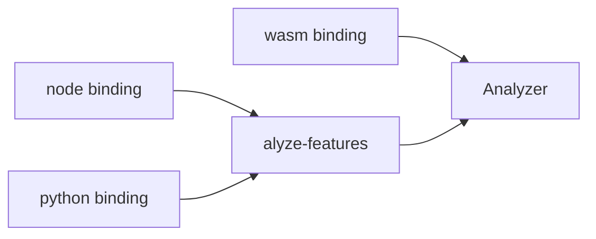

## Summary

Plain-language version: these three crates are translators. Someone writing JavaScript, Node, or Python wants to use alyze's Rust logic without writing Rust, so each crate hands them a version of it in their own language.

They differ in how much of the Rust surface they translate:

[wasm](../../wasm/src/lib.rs) wraps the [Analyzer](./analyzer.md) directly, for a client-side "try it" widget. [node](../../node/src/lib.rs) and [python](../../python/src/lib.rs) both wrap [alyze-features](./alyze-features.md) instead, for scoring re-rankers written in those languages. alyze-features calls the Analyzer internally, node/python callers just never touch it directly. All three re-validate their options with the same rules the turbopuffer API itself enforces, so an invalid config fails the same way in every language.

## Responsibilities

- Translating each host language's option object into a validated `AnalysisOptions`, rejecting invalid combinations (stemming/stopwords + case-sensitive, unsupported language, out-of-range `max_token_length`) with an error matching the turbopuffer API's own message text.
- Adapting the Rust callback-based analysis loop into whatever the host language expects: a `Vec` of plain objects (wasm, via `serde_wasm_bindgen`), or a stateful object with methods (`node`/`python`, via `napi`/`pyo3`).
- Holding a `ReusableBuffer` per bound analyzer instance (behind a `Mutex`, since the host language can call in from multiple threads) so repeated calls don't reallocate.

## Public API / entry points

- **wasm** ([wasm/src/lib.rs](../../wasm/src/lib.rs)): `analyze(text, options) -> Token[]`, `sentences(text) -> SentenceRange[]`, `languages() -> LanguageInfo[]`, all `#[wasm_bindgen]` free functions, JS objects in and out via `serde_wasm_bindgen`.
- **node** ([node/src/lib.rs](../../node/src/lib.rs)): `new Analyzer(options)`, `.analyze(text) -> Analyzed`, then feature methods on `Analyzed` (`elementSimilarity`, `fieldMatch`, …) taking another `Analyzed` as the argument, built with `napi`/`napi-rs`. `new Analyzed(text)` is also available directly with a fixed default configuration.
- **python** ([python/src/lib.rs](../../python/src/lib.rs)): the same shape as node: `Analyzer(...)` keyword-only constructor, `.analyze(text) -> Analyzed`, feature methods on `Analyzed`, built with `pyo3` (`#[pyclass]`/`#[pymethods]`).

## Key files

- [wasm/src/lib.rs](../../wasm/src/lib.rs), [wasm/Cargo.toml](../../wasm/Cargo.toml), [wasm/build.sh](../../wasm/build.sh): wasm-bindgen crate + build script
- [node/src/lib.rs](../../node/src/lib.rs), [node/build.rs](../../node/build.rs), [node/package.json](../../node/package.json): napi-rs crate
- [python/src/lib.rs](../../python/src/lib.rs), [python/pyproject.toml](../../python/pyproject.toml): pyo3 crate (built via maturin)

## Key data structures

A host language can't reach into a Rust struct directly, so each binding defines its own small stand-in shapes and copies data across that boundary. That's all the structs below are: repackaging, not new logic.

### wasm's `Options` / `Token` / `LanguageInfo` (wasm/src/lib.rs)

Plain `serde` structs, not exposed as classes: `Options` (`#[derive(Deserialize)]`, `#[serde(default, deny_unknown_fields)]` so unknown JS fields are a hard error rather than silently ignored) mirrors the turbopuffer API's snake_case option names directly. `Token` (`#[derive(Serialize)]`) is the per-call output shape: `text`, `position`, `start`/`end` (byte range). `LanguageInfo` describes one language's capabilities (`stemming: bool`, `stopwords: bool`) so a UI can build a language picker from a single call to `languages()` instead of hardcoding the list twice.

### node/python's `AnalyzerOptions` + `Analyzer` (node/src/lib.rs, python/src/lib.rs)

Unlike wasm's free functions, node and python expose a persistent `Analyzer` object (`#[napi] struct Analyzer` / `#[pyclass(frozen)] struct Analyzer`) holding the compiled `AlyzeAnalyzer` plus a `Mutex<ReusableBuffer>`. Building it once and calling `.analyze(text)` per field is what lets the [stemming cache](./analyzer.md) actually pay off across a batch: a fresh `Analyzer` per call would reset it every time.

### `Analyzed` (node/src/lib.rs, python/src/lib.rs)

A thin newtype wrapper (`inner: features::Analyzed`) around [alyze-features](./alyze-features.md)'s `Analyzed`, re-exposed as a class with feature methods attached directly to it (`query.elementSimilarity(document)`, `query.fieldMatch(document)`, …) so the host-language API reads as query-object-calls-method-with-field-argument, matching the doc comment's example usage.

### wasm's `SentenceRange` (wasm/src/lib.rs)

The output shape for the standalone `sentences()` API, which calls `uax29::sentence::tokenize` directly: the only binding entry point that reaches the [Tokenizer](./tokenizer.md) without going through the [Analyzer](./analyzer.md), since sentence boundaries aren't part of the word-analysis pipeline.

## Dependencies

- [Analyzer](./analyzer.md): wasm calls it directly.
- [alyze-features](./alyze-features.md): node and python wrap this, not the raw `Analyzer`.
- [Tokenizer](./tokenizer.md): wasm's `sentences()` calls `uax29::sentence::tokenize` directly.
- `wasm-bindgen` + `serde_wasm_bindgen` (wasm), `napi`/`napi-rs` (node), `pyo3` (python): the three FFI layers.

## Participates in

- Each binding is a separate publishable package (npm, PyPI, and a wasm bundle) built from this one Rust workspace, so tokenization/analysis/feature behavior stays byte-identical across every language turbopuffer client code runs in.

## Related

- [Analyzer: filter pipeline](./analyzer.md)
- [alyze-features](./alyze-features.md)
- [Tokenizer: UAX #29 word/sentence segmentation](./tokenizer.md)