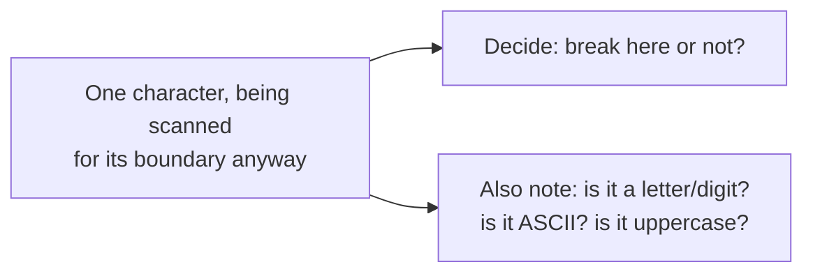
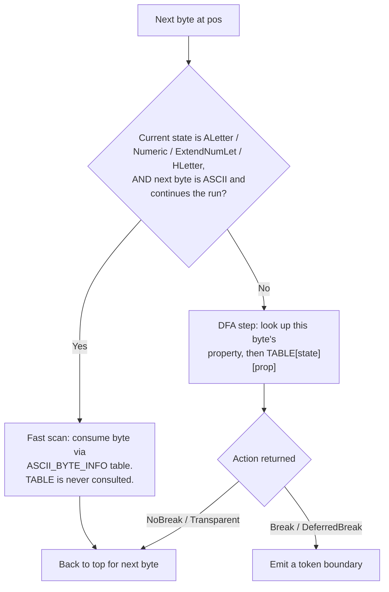

## Summary

The tokenizer is alyze's UAX #29 word/sentence boundary engine: a hand-rolled deterministic finite automaton (DFA) that decides, byte by byte, where one token ends and the next begins. Everything downstream (the [Analyzer](./analyzer.md)) consumes its output. Lives in `src/uax29/` ([mod.rs](../../src/uax29/mod.rs), [word/](../../src/uax29/word/mod.rs), [sentence/](../../src/uax29/sentence/mod.rs)).

**Naive model first:** this is [step 1, "split into words,"](../OVERVIEW.md#what-happens-to-your-data-in-plain-english) from the plain-English walkthrough. Everything below (`State`, `TABLE`, `TokenProperties`) is *how* that split is done correctly and fast, not a different thing happening to the text.

## Responsibilities

- Word segmentation (`uax29::word::tokenize`), the hot path, used by the Analyzer for every input.
- Sentence segmentation (`uax29::sentence::tokenize`), used by the [wasm binding](./bindings.md)'s standalone sentence API.
- Emitting per-token `TokenProperties` (word-like / ASCII / has-uppercase) as a byproduct of the same scan, so downstream filters don't have to re-scan the token.
- ASCII fast-pathing: for runs of letters/digits/underscore, use a simple lookup table instead of the DFA's real rule table (diagram below, under "Driver loop").

## Public API / entry points

- `uax29::word::tokenize(text, Options, on_breakpoint: FnMut(usize, TokenProperties) -> bool)`, [src/uax29/word/mod.rs](../../src/uax29/word/mod.rs)
- `uax29::sentence::tokenize(text, Options, on_breakpoint: FnMut(usize) -> bool)`, [src/uax29/sentence/mod.rs](../../src/uax29/sentence/mod.rs)

Both are callback-based, not iterator-based: the caller supplies a closure invoked at each boundary, and returning `false` stops early. No token objects or `Vec` allocations happen inside the tokenizer itself.

## Key files

- [src/uax29/mod.rs](../../src/uax29/mod.rs): shared `State`/`Action`/break-property-enum macros, the `Action` enum
- [src/uax29/word/mod.rs](../../src/uax29/word/mod.rs): the word DFA driver loop + `TokenProperties`
- [src/uax29/word/properties.rs](../../src/uax29/word/properties.rs): `WordBreakProperty`, ASCII lookup table, dictionary lookup
- [src/uax29/word/transitions.rs](../../src/uax29/word/transitions.rs): `State` enum, `Transition`, the `TABLE`
- [src/uax29/sentence/mod.rs](../../src/uax29/sentence/mod.rs), [properties.rs](../../src/uax29/sentence/properties.rs), [transitions.rs](../../src/uax29/sentence/transitions.rs): sentence-boundary mirror of the above
- [testdata/WordBreakTest.txt](../../testdata/WordBreakTest.txt), [testdata/SentenceBreakTest.txt](../../testdata/SentenceBreakTest.txt): the official Unicode conformance suites both DFAs are tested against (1944/1944 word-break tests pass)

## Key data structures

### `State` (transitions.rs)

A `#[repr(u8)]` enum generated by the `state_enum!` macro: one variant per DFA state (for words: `StartOfText, Any, CR, ALetter, Numeric, HLetter, Katakana, ExtendNumLet, WSegSpace, AHLetterMid, Newline, RIOdd, NumericMid, HLetterDQ, HLetterSQ`). `is_deferred()` flags the three states (`AHLetterMid`, `NumericMid`, `HLetterDQ`) whose break decision depends on the *next* character: e.g. in `can't`, whether the `'` breaks isn't known until the following char is seen.

### `WordBreakProperty` (properties.rs)

The Unicode Word_Break property value for a character (`ALetter`, `Numeric`, `MidLetter`, `ZWJ`, …), generated by the `break_property_enum!` macro. Looked up two ways:
- **ASCII (0-127)**: `ASCII_WORD_BREAK_PROP`, a flat 128-entry const array. O(1), no branching.
- **Non-ASCII**: `lookup_word_break_property_from_dictionary`, backed by the `tpuf_icu_properties_211` crate's Unicode data tables.

### `Transition` + `TABLE` (transitions.rs)

`Transition(State, Action)` is the DFA's edge. `TABLE: [[Transition; WordBreakProperty::NUM_VARIANTS]; State::NUM_VARIANTS]` is the full transition table: a `State × WordBreakProperty` matrix, built at compile time via `const fn`. Stepping the DFA is one array index: `TABLE[state as usize][prop as usize]`.

### `Action` (uax29/mod.rs)

What a transition does beyond moving state: `Break` (emit a boundary), `NoBreak`, `DeferredBreak` (resolve a previously-deferred boundary without consuming the current char), `Transparent` (consume the char, invisible to boundary decisions; used for WB4 Extend/Format/ZWJ transparency).

### `TokenProperties` (word/mod.rs)

A `u8` bitmask (`WORD_LIKE`, `NON_ASCII`, `HAS_ASCII_UPPER`) computed as a side effect of the scan that's already happening, not an extra pass:

This is the single most load-bearing data structure in the crate: it's the signal that gates every downstream fast path in the [Analyzer](./analyzer.md) (skip lowercasing when `!has_ascii_upper()`, skip stopword/stemming checks on non-word-like tokens, etc). Stored disjunctively (one non-ASCII byte anywhere in the span sets the bit for the whole token) and reset per-token. Sharp edge: a *breaking* character's properties belong to the *next* token, not the one just closed. `"ab🛑"` must report `ab` as ASCII and `🛑` as non-ASCII, which the driver loop handles by applying the breaking char's `char_props` only after `std::mem::take`-ing the closed token's props.

### Driver loop: which bytes hit the DFA (word/mod.rs)

Every byte takes one of two paths, decided fresh each loop iteration:

A byte is "in the DFA" only on the Slow branch, where `TABLE[state][prop]` actually gets read. Bytes consumed by the fast scan never touch `TABLE` at all; they're only ever checked against `ASCII_BYTE_INFO`, a completely different (much smaller) lookup. The fast path is reachable only when the current state guarantees every possible outcome on that branch is `NoBreak` anyway, so skipping the real table costs nothing.

### ASCII fast-path tables (word/mod.rs)

`ASCII_BYTE_INFO: [u8; 128]` packs, per ASCII byte, both "does this continue a word-like run" (top bit) and its `TokenProperties` contribution (low bits) into a single byte, so the fast-path scan loop is a table lookup + OR + increment, no DFA step, no `char` decoding. `WORD_BREAK_CONTRIB` is the analogous small const array mapping each `WordBreakProperty` variant to its cheap-path `TokenProperties` contribution.

## Dependencies

- `tpuf_icu_properties_211`: pinned Unicode Character Database snapshot for non-ASCII property lookups (word-break property, script, general category, ideographic, extended-pictographic). Pinned deliberately: a UCD version bump would silently change tokenization, and search requires byte-for-byte reproducibility across time.
- `itertools` (dev-only): powers the conformance-test harness in `uax29::test_helpers`.

## Participates in

- The [Analyzer](./analyzer.md) drives `word::tokenize` as its first pipeline stage and consumes `TokenProperties` to gate every filter after it.
- The [wasm binding](./bindings.md) exposes `sentence::tokenize` directly as a standalone `sentences()` API.

## Related

- [Analyzer: filter pipeline](./analyzer.md)
- [alyze-features](./alyze-features.md)
- [Bindings (wasm / node / python)](./bindings.md)